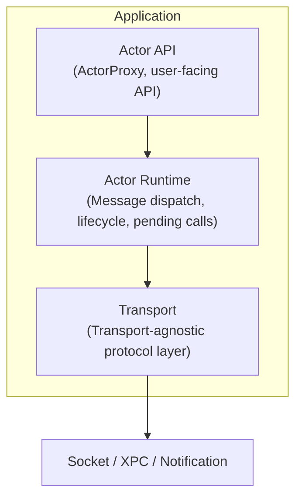

# CLAUDE.md

This file provides guidance to Claude Code (claude.ai/code) when working with code in this repository.

## Project Overview

ActorLink is an actor-based IPC runtime for Swift applications. It enables type-safe, asynchronous inter-process communication using a Swift Concurrency-friendly API. Current version: **0.1.0**.

## Architecture



## Project Structure

```
ActorLink
├── Sources
│   ├── ActorLink              # Core runtime
│   │   ├── Envelope.swift     # Request message
│   │   ├── RPCResponse.swift  # Response message
│   │   ├── ActorTransport.swift
│   │   ├── ActorHandler.swift
│   │   ├── Dispatcher.swift
│   │   ├── ActorRuntime.swift
│   │   ├── ActorProxy.swift
│   │   ├── ActorLinkError.swift
│   │   └── ActorLinkVersion.swift
│   └── ActorLinkSocket        # Socket transport
│       └── LocalSocketTransport.swift
└── Tests
    ├── ActorLinkTests          # Unit tests (core types, dispatcher)
    └── ActorLinkSocketTests    # Integration tests (end-to-end IPC)
```

## Key Implementation Details

### Transport Layer (ActorTransport protocol)
- `start()` creates socket, binds/listens (server) or connects (client)
- Server `accept()` runs on a detached Task (not on cooperative thread pool)
- All sends/receives suspend via `ConnectionGate` until the connection is ready
- Framing: 4-byte big-endian length prefix + JSON payload

### ActorRuntime
- Actor-based, manages pending calls via `CheckedContinuation`
- Server: dispatches incoming envelopes to registered `ActorHandler`
- Client: sends envelopes, correlates responses to pending calls
- Handles early-arriving responses via `earlyResponses` cache

## Build & Test

```bash
# Build all targets
swift build

# Run all tests
swift test

# Run specific test target
swift test --filter ActorLinkSocketTests

# Build in release mode
swift build -c release
```

## Platform Support

- **macOS 15+** (primary, actively tested)
- **iOS 18+** (planned)
- Linux: not supported

## Development Roadmap

- **v0.1.0** ✅ Core runtime: Envelope, Dispatcher, LocalSocketTransport, Request/Response, async/await, end-to-end IPC tests
- **v0.2** XPCTransport, Heartbeat, Reconnect, Timeout
- **v0.3** Actor Macro, auto-generated Proxy/Stub
- **v0.4** Distributed Actor Adapter, Actor Discovery
- **v1.0** Production-ready: App ↔ Extension, App ↔ Helper, App ↔ Daemon

## Key Design Principles

- **Swift First** — Built on async/await, Actor, Codable
- **Transport Agnostic** — Business code does not touch transport layer
- **Local First** — Prioritizes App ↔ Extension, App ↔ Helper, App ↔ Daemon
- **Progressive Enhancement** — Start with simple Socket, add XPC → Distributed Actors → Cluster Transport

## Documentation

All architecture diagrams must use [Mermaid](https://mermaid.js.org/) syntax.
