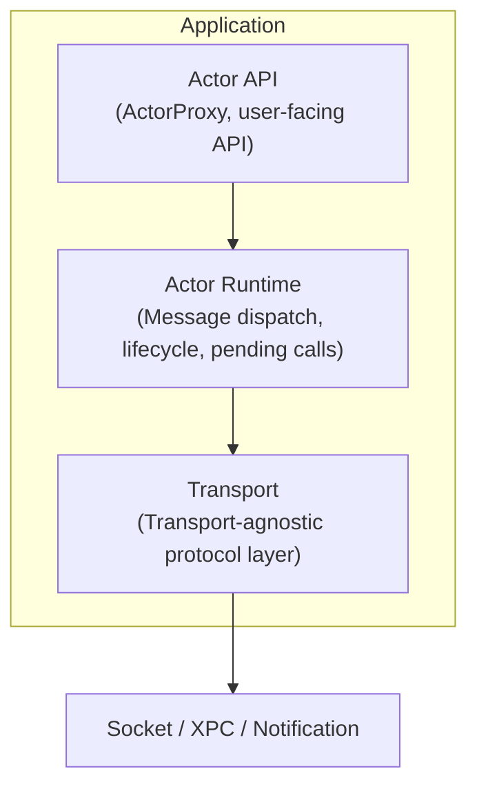

# CLAUDE.md

This file provides guidance to Claude Code (claude.ai/code) when working with code in this repository.

## Project Overview

ActorLink is an actor-based IPC runtime for Swift applications. It enables type-safe, asynchronous inter-process communication using a Swift Concurrency-friendly API. Currently in early development (pre-v0.1).

## Architecture



### Planned Core Components

- **ActorProxy** — Client-side proxy: serializes method calls, sends via transport, awaits responses
- **ActorRuntime** — Core runtime: message dispatch, lifecycle, pending call tracking
- **Dispatcher** — Server-side router: receives Envelope → routes to target Actor
- **ActorTransport** — Protocol defining unified transport interface
- **LocalSocketTransport** — Unix Domain Socket transport (v0.1 target)
- **XPCTransport** — XPC transport (v0.2 target)
- **NotificationTransport** — Broadcast/state-invalidation transport (planned)

### Planned Project Structure

```
ActorLink
├── Sources
│   ├── ActorLink         # Core runtime (Envelope, Dispatcher, Runtime)
│   ├── ActorLinkSocket   # LocalSocketTransport
│   └── ActorLinkXPC      # XPCTransport
├── Examples
│   ├── PingPong
│   ├── RClick
│   └── FinderSyncDemo
├── Tests
└── Docs
```

### Message Protocol

- `Envelope` — `{ id, actor, method, payload, replyTo }` — request message
- `RPCResponse` — `{ id, success, payload, error }` — response message

## Build & Test

```bash
# Build all targets
swift build

# Run all tests
swift test

# Build specific target
swift build --target ActorLink

# Run tests for specific target
swift test --filter ActorLinkTests

# Build in release mode
swift build -c release
```

## Development Roadmap

- **v0.1** — Envelope, Dispatcher, LocalSocketTransport, Request/Response, async/await integration
- **v0.2** — XPCTransport, Heartbeat, Reconnect, Timeout
- **v0.3** — Actor Macro, auto-generated Proxy/Stub
- **v0.4** — Distributed Actor Adapter, Actor Discovery
- **v1.0** — Production-ready: App ↔ Extension, App ↔ Helper, App ↔ Daemon

## Key Design Principles

- **Swift First** — Built on async/await, Actor, Codable
- **Transport Agnostic** — Business code does not touch transport layer
- **Local First** — Prioritizes App ↔ Extension, App ↔ Helper, App ↔ Daemon
- **Progressive Enhancement** — Start with simple Socket, add XPC → Distributed Actors → Cluster Transport
