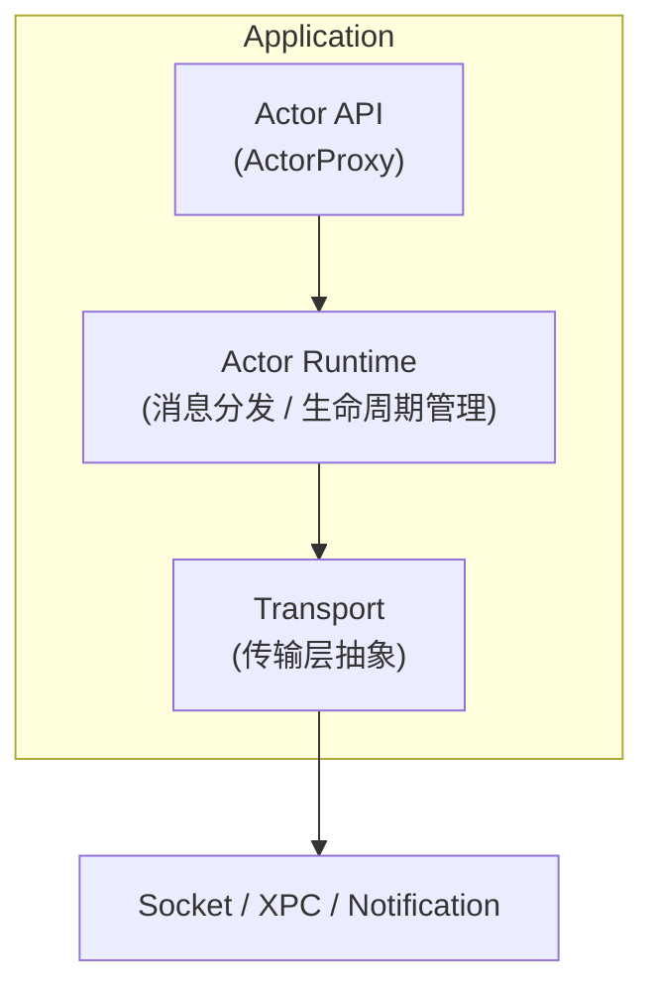
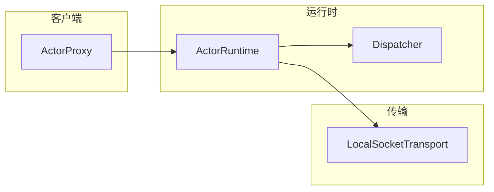
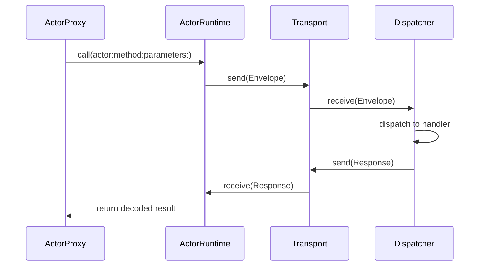

# ActorLink

> Actor-based IPC Runtime for Swift Applications

ActorLink 是一个基于 Swift Concurrency 的轻量级 IPC（Inter-Process Communication）运行时。它让开发者使用类似 Actor 的编程模型，在不同进程之间进行类型安全、异步、可扩展的通信，而无需直接处理 XPC、Socket、Notification 等底层细节。

## 为什么创建 ActorLink

在 macOS 和 iOS 开发中，应用与 Extension 之间的通信方案各有不足：

| 方案 | 问题 |
|------|------|
| XPC | API 复杂，调试困难，与 Swift Concurrency 集成有限 |
| DistributedNotificationCenter | 无返回值，无可靠性保证，不适合 RPC |
| Socket | 需要自行实现协议层 |

ActorLink 的目标是：**让跨进程调用像调用本地 Actor 一样简单。**

```swift
let menuService = ActorProxy<MenuService>()

let result = try await menuService.reloadMenus()
```

## 架构



## 核心组件



消息流程：



## 核心原则

- **Swift First** — 基于 async/await、Actor、Codable 构建
- **Transport Agnostic** — 业务代码不感知传输层
- **Local First** — 优先解决 App ↔ Extension、App ↔ Helper、App ↔ Daemon
- **Progressive Enhancement** — 从简单 Socket 开始，逐步支持 XPC、Distributed Actors

## 使用场景

- FinderSync Extension ↔ Main App
- Share Extension ↔ Main App
- MenuBar App ↔ Background Service
- GUI ↔ Daemon

## 项目结构

```
ActorLink
├── Sources
│   ├── ActorLink          # 核心运行时
│   │   ├── Envelope.swift
│   │   ├── RPCResponse.swift
│   │   ├── ActorTransport.swift
│   │   ├── ActorHandler.swift
│   │   ├── Dispatcher.swift
│   │   ├── ActorRuntime.swift
│   │   ├── ActorProxy.swift
│   │   └── ActorLinkError.swift
│   └── ActorLinkSocket    # Socket 传输实现
│       └── LocalSocketTransport.swift
└── Tests
    └── ActorLinkTests
```

## 开发路线图

| 版本 | 内容 |
|------|------|
| v0.1 | Envelope、Dispatcher、LocalSocketTransport、Request/Response、async/await |
| v0.2 | XPCTransport、Heartbeat、Reconnect、Timeout |
| v0.3 | Actor Macro、自动生成 Proxy/Stub |
| v0.4 | Distributed Actor Adapter、Actor Discovery |
| v1.0 | 生产可用：App ↔ Extension、App ↔ Helper、App ↔ Daemon |

## 构建

```bash
swift build
swift test
```

## License

MIT

## Author

Li Xu
