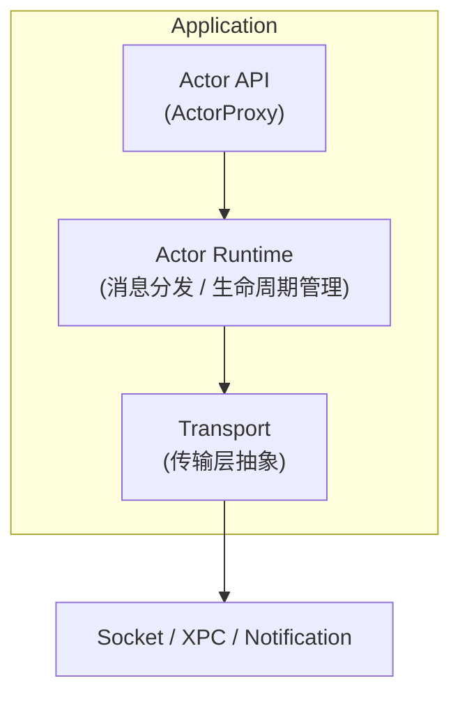
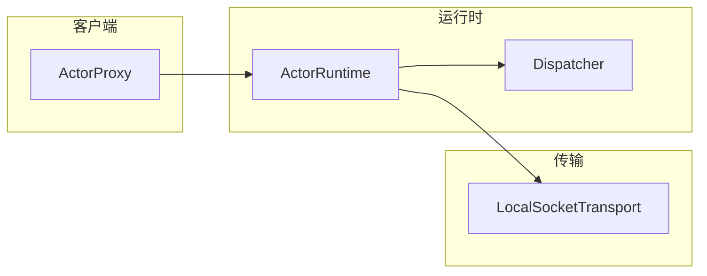
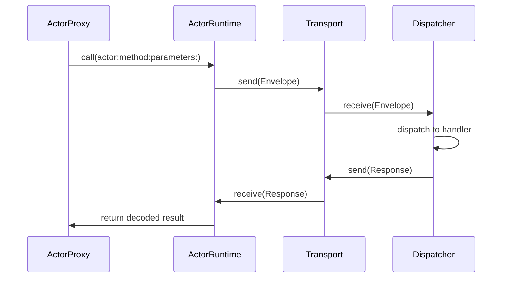

# ActorLink

> Actor-based IPC Runtime for Swift Applications

[](https://swiftpackageindex.com/wflixu/ActorLink)

ActorLink 是一个基于 Swift Concurrency 的轻量级 IPC（Inter-Process Communication）运行时。它让开发者使用类似 Actor 的编程模型，在不同进程之间进行类型安全、异步、可扩展的通信，而无需直接处理 XPC、Socket、Notification 等底层细节。

## 为什么创建 ActorLink

在 macOS 和 iOS 开发中，应用与 Extension 之间的通信方案各有不足：

| 方案 | 问题 |
|------|------|
| XPC | API 复杂，调试困难，与 Swift Concurrency 集成有限 |
| DistributedNotificationCenter | 无返回值，无可靠性保证，不适合 RPC |
| Socket | 需要自行实现协议层 |

ActorLink 的目标是：**让跨进程调用像调用本地 Actor 一样简单。**

```swift
let menuService = ActorProxy<MenuService>()

let result = try await menuService.reloadMenus()
```

## 快速开始

### 1. 在 Package.swift 中添加依赖

```swift
dependencies: [
    .package(path: "path/to/ActorLink"),
],
targets: [
    .executableTarget(
        name: "MyApp",
        dependencies: [
            .product(name: "ActorLink", package: "ActorLink"),
            .product(name: "ActorLinkSocket", package: "ActorLink"),
        ]
    ),
]
```

### 2. 服务端：注册 Actor 并启动

```swift
import ActorLink
import ActorLinkSocket

struct GreetHandler: ActorHandler {
    func handle(_ envelope: Envelope) async throws -> RPCResponse {
        let name = try JSONDecoder().decode(String.self, from: envelope.payload)
        let result = "Hello, \(name)!"
        let data = try JSONEncoder().encode(result)
        return RPCResponse(id: envelope.id, success: true, payload: data)
    }
}

// 创建传输层（服务端）
// 沙盒环境下必须使用 App Group 共享目录：
let transport = try LocalSocketTransport.appGroup(
    "group.com.example",
    isServer: true
)

// 配置运行时
let dispatcher = Dispatcher()
await dispatcher.register(GreetHandler(), for: "Greeter")
let runtime = ActorRuntime(transport: transport, dispatcher: dispatcher)
try await runtime.start()
```

### 3. 客户端：在另一个进程中调用

```swift
import ActorLink
import ActorLinkSocket

let transport = try LocalSocketTransport.appGroup(
    "group.com.example",
    isServer: false
)
let runtime = ActorRuntime(transport: transport)
try await runtime.start()

let result: String = try await runtime.call(
    actor: "Greeter",
    method: "greet",
    parameters: "World"
)
print(result) // "Hello, World!"
```

> **沙盒说明：** 对于 App Extension 等沙盒场景，socket 文件**必须**放在 App Group 共享目录内。使用 `LocalSocketTransport.appGroup(_:socketName:isServer:)` 工厂方法自动创建，无需手动拼接路径。非沙盒场景（如 Helper Tool、Daemon）可以直接使用 `init(socketPath:isServer:)`。

## 架构



## 核心组件



消息流程：



## 核心原则

- **Swift First** — 基于 async/await、Actor、Codable 构建
- **Transport Agnostic** — 业务代码不感知传输层
- **Local First** — 优先解决 App ↔ Extension、App ↔ Helper、App ↔ Daemon
- **Progressive Enhancement** — 从简单 Socket 开始，逐步支持 XPC、Distributed Actors

## 使用场景

- FinderSync Extension ↔ Main App
- Share Extension ↔ Main App
- MenuBar App ↔ Background Service
- GUI ↔ Daemon

## 项目结构

```
ActorLink
├── Sources
│   ├── ActorLink              # 核心运行时
│   │   ├── Envelope.swift
│   │   ├── RPCResponse.swift
│   │   ├── ActorTransport.swift
│   │   ├── ActorHandler.swift
│   │   ├── Dispatcher.swift
│   │   ├── ActorRuntime.swift
│   │   ├── ActorProxy.swift
│   │   ├── ActorLinkError.swift
│   │   └── ActorLinkVersion.swift
│   └── ActorLinkSocket        # Socket 传输实现
│       └── LocalSocketTransport.swift
├── Tests
│   ├── ActorLinkTests          # 单元测试（核心类型、Dispatcher）
│   └── ActorLinkSocketTests    # 集成测试（端到端 IPC）
└── specs
    └── design.md
```

## Platform Support

当前版本仅支持 **macOS 15+**。iOS 18+ 支持规划中。

## 开发路线图

| 版本 | 状态 | 内容 |
|------|------|------|
| v0.1.0 | ✅ 已完成 | Envelope、Dispatcher、LocalSocketTransport、Request/Response、async/await、端到端 IPC 测试 |
| v0.2 | ⏳ 规划中 | XPCTransport、Heartbeat、Reconnect、Timeout |
| v0.3 | ⏳ 规划中 | Actor Macro、自动生成 Proxy/Stub |
| v0.4 | ⏳ 规划中 | Distributed Actor Adapter、Actor Discovery |
| v1.0 | ⏳ 规划中 | 生产可用：App ↔ Extension、App ↔ Helper、App ↔ Daemon |

## 构建

```bash
swift build
swift test
```

## License

MIT

## Author

Li Xu
