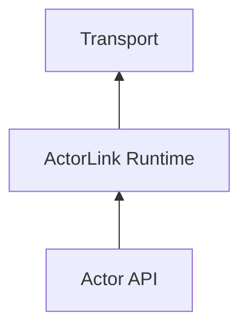
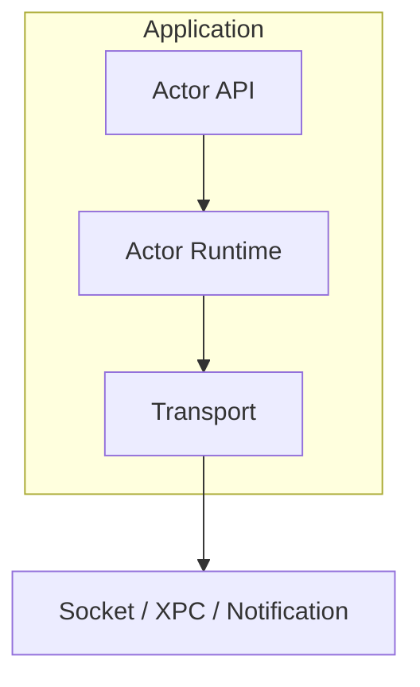

# ActorLink

> Actor-based IPC Runtime for Swift Applications

ActorLink 是一个基于 Swift Concurrency 的轻量级 IPC（Inter-Process Communication）运行时。

它旨在让开发者使用类似 Actor 的编程模型，在不同进程之间进行类型安全、异步、可扩展的通信，而无需直接处理 XPC、Socket、Notification 等底层细节。

## 为什么创建 ActorLink

在 macOS 和 iOS 开发中，应用与扩展（Extension）之间的通信通常依赖：

- XPC
- DistributedNotificationCenter
- Darwin Notification
- App Group + Shared Storage
- Unix Domain Socket

这些方案都存在不同程度的问题：

### XPC

优点：

- 官方支持
- 类型安全
- 稳定

缺点：

- API 复杂
- 调试困难
- 与 Swift Concurrency 集成有限

### Notification

优点：

- 简单

缺点：

- 无返回值
- 无可靠性保证
- 不适合 RPC

### Socket

优点：

- 灵活
- 可调试

缺点：

- 需要自行实现协议层

ActorLink 的目标是：

> 让跨进程调用像调用本地 Actor 一样简单。

---

# 愿景

未来开发者应该能够编写：

```swift
let menuService = ActorProxy<MenuService>()

let result = try await menuService.reloadMenus()
```

而无需关心底层使用的是：

- XPC
- Unix Domain Socket
- DistributedNotificationCenter

甚至未来可能是：

- Network Transport
- Distributed Actors

---

# 核心原则

## Swift First

基于：

- async / await
- Actor
- Codable

构建。

## Transport Agnostic

业务代码不感知传输层。



## Local First

优先解决：

- App ↔ Extension
- App ↔ Helper
- App ↔ Daemon

场景。

## Progressive Enhancement

从简单 Socket 开始。

未来支持：

- XPC
- Distributed Actors
- Cluster Transport

---

# 架构



---

# 核心组件

## ActorProxy

客户端代理。

负责：

- 方法调用
- 参数序列化
- Response 处理

```swift
let result = try await menuService.ping()
```

---

## ActorRuntime

运行时核心。

负责：

- 消息分发
- 生命周期管理
- Pending Calls

---

## Dispatcher

服务端路由器。


---

## Transport

负责实际通信。

统一接口：

```swift
protocol ActorTransport
```

---

# Transport 实现

## LocalSocketTransport

状态：

v0.1

基于：

```text
Unix Domain Socket
```

特点：

- 高性能
- 可调试
- App Group 兼容
- Extension 友好

---

## XPCTransport

状态：

v0.2

目标：

- 与 App Sandbox 深度集成
- Production Ready

---

## NotificationTransport

状态：

规划中

用途：

- Broadcast
- State Invalidation

不用于 RPC

---

# 消息协议

## Envelope

```swift
struct Envelope: Codable {
    let id: UUID
    let actor: String
    let method: String
    let payload: Data
    let replyTo: UUID?
}
```

---

## Response

```swift
struct RPCResponse: Codable {
    let id: UUID
    let success: Bool
    let payload: Data?
    let error: String?
}
```

---

# 项目结构

```text
ActorLink
├── Sources
│   ├── ActorLink
│   │
│   ├── ActorLinkSocket
│   │
│   └── ActorLinkXPC
│
├── Examples
│   ├── PingPong
│   ├── RClick
│   └── FinderSyncDemo
│
├── Tests
│
└── Docs
```

---

# 开发路线图

## v0.1

目标：

最小可用 Runtime

功能：

- Envelope
- Dispatcher
- LocalSocketTransport
- Request / Response
- Async Await Integration

---

## v0.2

功能：

- XPCTransport
- Heartbeat
- Reconnect
- Timeout

---

## v0.3

功能：

- Actor Macro
- 自动生成 Proxy
- 自动生成 Stub

---

## v0.4

功能：

- Distributed Actor Adapter
- Actor Discovery

---

## v1.0

目标：

生产可用

支持：

- App ↔ Extension
- App ↔ Helper
- App ↔ Daemon

---

# 使用场景

## FinderSync Extension


---

## Share Extension


---

## MenuBar App


---

## Helper Tool


---

# 示例项目

## RClick

ActorLink 的首个真实生产案例。

目标：

使用 ActorLink 替换：

- DistributedNotificationCenter
- 自定义 IPC

实现：


---

# License

MIT

---

# 作者

Li Xu

Built for modern Swift IPC.